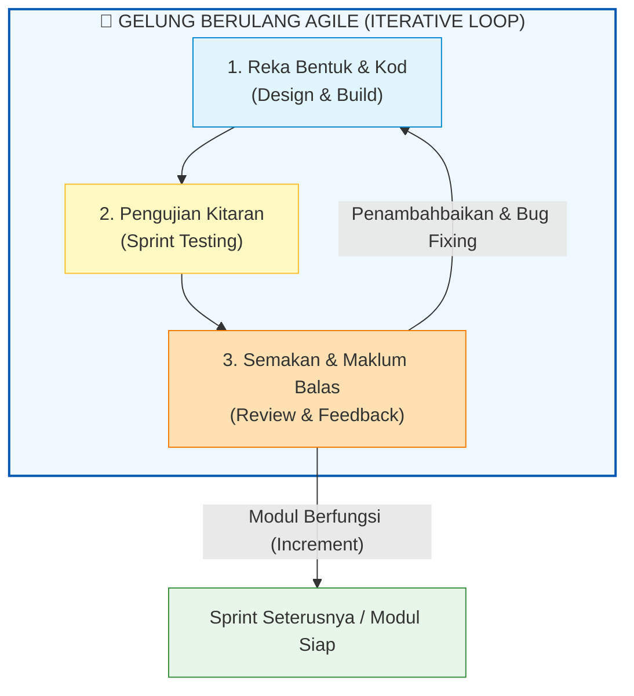

```mermaid
flowchart TD
    %% Gelung Berulang Agile bagi OyenTaxi
    subgraph Sprint_Loop ["🔄 GELUNG BERULANG AGILE (ITERATIVE LOOP)"]
        direction LR
        A["1. Reka Bentuk & Kod<br/>(Design & Build)"] --> B["2. Pengujian Kitaran<br/>(Sprint Testing)"]
        B --> C["3. Semakan & Maklum Balas<br/>(Review & Feedback)"]
        
        %% Anak Panah Melengkung Umpan Balik (Feedback)
        C -->|"Penambahbaikan & Bug Fixing"| A
    end

    %% Hasil Penyerahan
    C -->|"Modul Berfungsi (Increment)"| D["Sprint Seterusnya / Modul Siap"]

    %% Gaya Visual
    style Sprint_Loop fill:#f0f8ff,stroke:#0056b3,stroke-width:2px
    style A fill:#e1f5fe,stroke:#0288d1
    style B fill:#fff9c4,stroke:#fbc02d
    style C fill:#ffe0b2,stroke:#f57c00
    style D fill:#e8f5e9,stroke:#388e3c
```
