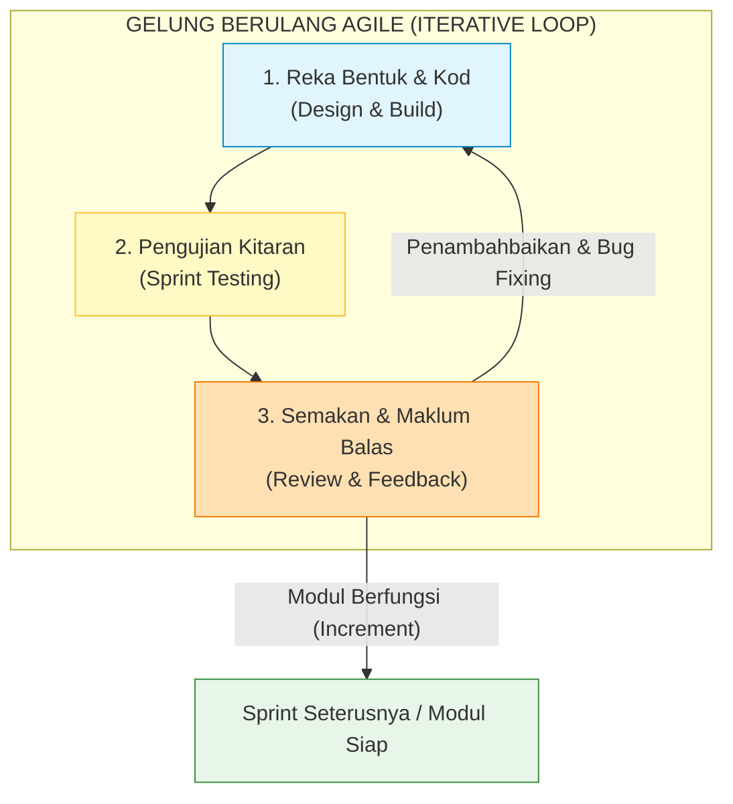

```mermaid
flowchart TD
    subgraph Sprint_Loop ["GELUNG BERULANG AGILE (ITERATIVE LOOP)"]
        direction LR
        A["1. Reka Bentuk & Kod<br/>(Design & Build)"] --> B["2. Pengujian Kitaran<br/>(Sprint Testing)"]
        B --> C["3. Semakan & Maklum Balas<br/>(Review & Feedback)"]
        C -->|"Penambahbaikan & Bug Fixing"| A
    end

    C -->|"Modul Berfungsi (Increment)"| D["Sprint Seterusnya / Modul Siap"]

    style A fill:#e1f5fe,stroke:#0288d1
    style B fill:#fff9c4,stroke:#fbc02d
    style C fill:#ffe0b2,stroke:#f57c00
    style D fill:#e8f5e9,stroke:#388e3c
```
